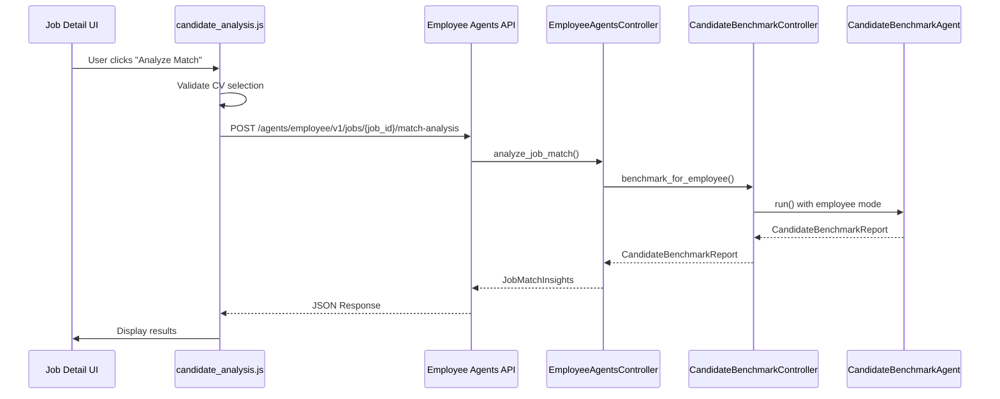

# Design Document

## Overview

This design document outlines the technical approach to fix the broken AI-Based Candidate Fit Analysis functionality in
the Job Finders platform. The issue stems from a frontend-backend integration gap where the JavaScript code calls a
non-existent API endpoint. The solution leverages the existing candidate benchmark infrastructure while creating a
proper integration layer.

The fix involves updating the frontend JavaScript to call the correct employee agents endpoint and ensuring proper data
flow between the UI components and the backend candidate analysis system.

## Architecture

### Current System Architecture

The platform already has a robust candidate analysis system with the following components:

```
Frontend (Job Detail Page)
├── job_sidebar.html (UI Components)
├── candidate_analysis.js (Broken Integration)
└── job_statistics_scripts.html (Script Loading)

Backend (Existing Infrastructure)
├── CandidateBenchmarkController (Core Logic)
├── EmployeeAgentsController (Job Seeker Perspective)
├── Employee Agents Route (/agents/employee/v1/jobs/<job_id>/match-analysis)
├── CandidateBenchmarkAgent (AI Processing)
└── CandidateBenchmarkReport (Data Model)
```

### Fixed Architecture Flow



## Components and Interfaces

### Frontend Components

#### 1. Updated JavaScript Integration (`candidate_analysis.js`)

**Current Issues:**

- Calls non-existent `/api/agents/candidate_analysis` endpoint
- Expects different response structure than backend provides
- Missing proper error handling for authentication

**Design Changes:**

- Update endpoint to `/agents/employee/v1/jobs/${jobId}/match-analysis`
- Modify request payload to match expected backend format
- Update response parsing to handle `CandidateBenchmarkReport` structure
- Add proper authentication headers and error handling

#### 2. UI Components (`job_sidebar.html`)

**Current State:**

- Form structure is correct
- Results display area exists but expects different data format

**Design Changes:**

- Update result display to show `CandidateBenchmarkReport` fields
- Add proper formatting for percentile rank, strengths, and development areas
- Enhance error messaging for better user experience

### Backend Integration

#### 1. Employee Agents Route (Existing)

**Endpoint:** `POST /agents/employee/v1/jobs/<job_id>/match-analysis`

**Current Implementation:**

- Already exists and functional
- Requires authentication (`@jobseeker_login`)
- Accepts `cv_id` and optional `cover_letter` in request body
- Returns `JobMatchInsights` model

**Integration Requirements:**

- Ensure frontend sends correct payload format
- Verify response structure matches frontend expectations

#### 2. Data Flow Integration

**Current Flow:**

```
Employee Route → EmployeeAgentsController.analyze_job_match() → ApplicationCoachAgent → JobMatchInsights
```

**Required Flow for Candidate Analysis:**

```
Employee Route → CandidateBenchmarkController.benchmark_for_employee() → CandidateBenchmarkAgent → CandidateBenchmarkReport
```

**Design Decision:**
Create a new route method that calls the candidate benchmark controller instead of the application coach, or modify the
existing route to support both analysis types.

## Data Models

### Request/Response Models

#### Frontend Request Payload

```javascript
{
    "job_id": "string",     // From meta tag
    "cv_id": "string"       // From dropdown selection
}
```

#### Backend Response Model (CandidateBenchmarkReport)

```json
{
    "summary": "string",
    "percentile_rank": "float (0-100)",
    "key_strengths": ["string"],
    "development_areas": ["string"],
    "candidate_insights": ["string"],
    "cv_optimization_tips": ["string"],
    "growth_opportunities": ["string"]
}
```

#### Frontend Display Mapping

- `summary` → Match summary text
- `percentile_rank` → Match score display
- `key_strengths` → Strengths list
- `development_areas` → Areas for improvement
- `candidate_insights` → Additional insights
- `cv_optimization_tips` → CV improvement suggestions

### Data Validation

#### Frontend Validation

- CV selection is required before analysis
- Job ID must be present in page metadata
- User must be authenticated as job seeker

#### Backend Validation

- Job must exist and be active
- CV must belong to authenticated user
- User must have job seeker profile

## Error Handling

### Frontend Error Scenarios

1. **No CV Selected**
    - Display: "Please select a CV to analyze"
    - Action: Focus on CV dropdown

2. **Network/API Errors**
    - Display: "Analysis temporarily unavailable. Please try again."
    - Action: Log error, restore button state

3. **Authentication Errors**
    - Display: "Please log in to analyze job matches"
    - Action: Redirect to login or show login modal

4. **Validation Errors**
    - Display: Specific validation message from backend
    - Action: Highlight relevant form fields

### Backend Error Scenarios

1. **Missing Job/CV Data**
    - Log error with details
    - Return structured error response
    - HTTP 404 for missing resources

2. **AI Agent Failures**
    - Log agent execution errors
    - Return fallback response or retry
    - HTTP 500 for system errors

3. **Authentication/Authorization**
    - Standard authentication middleware handling
    - HTTP 401/403 responses

## Testing Strategy

### Frontend Testing

#### Unit Tests

- CV selection validation
- API request formatting
- Response parsing and display
- Error handling scenarios

#### Integration Tests

- End-to-end analysis workflow
- Authentication integration
- Error scenario handling
- UI state management

### Backend Testing

#### Existing Tests

- CandidateBenchmarkController tests (already exist)
- Employee agents route tests (already exist)
- Authentication middleware tests (already exist)

#### Additional Tests Required

- Integration between frontend payload and backend processing
- Error handling for missing data scenarios
- Response format validation

### Manual Testing Scenarios

1. **Happy Path**
    - User with multiple CVs
    - Select CV and analyze
    - Verify results display correctly

2. **Edge Cases**
    - User with no CVs
    - Invalid job ID
    - Network interruption during analysis

3. **Authentication**
    - Unauthenticated user
    - Job seeker vs employer access
    - Session expiration during analysis

## Implementation Approach

### Phase 1: Backend Route Enhancement

1. Modify employee agents route to support candidate benchmark analysis
2. Ensure proper integration with CandidateBenchmarkController
3. Update response format to include all required fields

### Phase 2: Frontend Integration Fix

1. Update `candidate_analysis.js` with correct endpoint
2. Modify request payload format
3. Update response parsing and display logic
4. Enhance error handling

### Phase 3: UI/UX Improvements

1. Improve results display formatting
2. Add loading states and animations
3. Enhance error messaging
4. Add success feedback

### Phase 4: Testing and Validation

1. Comprehensive testing of integration
2. User acceptance testing
3. Performance validation
4. Error scenario verification

## Security Considerations

### Authentication

- Maintain existing `@jobseeker_login` requirement
- Ensure CV access is limited to owner
- Validate job access permissions

### Data Privacy

- CV data should not be logged in detail
- Analysis results are user-specific
- No cross-user data leakage

### Rate Limiting

- Implement reasonable limits on analysis requests
- Prevent abuse of AI agent resources
- Monitor usage patterns

## Performance Considerations

### Frontend Performance

- Debounce rapid button clicks
- Show immediate loading feedback
- Cache results for same CV-job combinations

### Backend Performance

- Leverage existing agent caching mechanisms
- Monitor AI agent response times
- Implement timeout handling

### Database Performance

- Use existing optimized queries
- Minimize additional database calls
- Leverage existing indexes

## Monitoring and Observability

### Metrics to Track

- Analysis request success/failure rates
- Average response times
- User engagement with results
- Error frequency by type

### Logging Requirements

- Analysis request initiation
- Agent execution results
- Error conditions with context
- User interaction patterns

### Alerting

- High error rates
- Slow response times
- Agent failures
- Authentication issues

This design ensures a robust, maintainable solution that leverages existing infrastructure while providing a seamless
user experience for the candidate fit analysis feature.