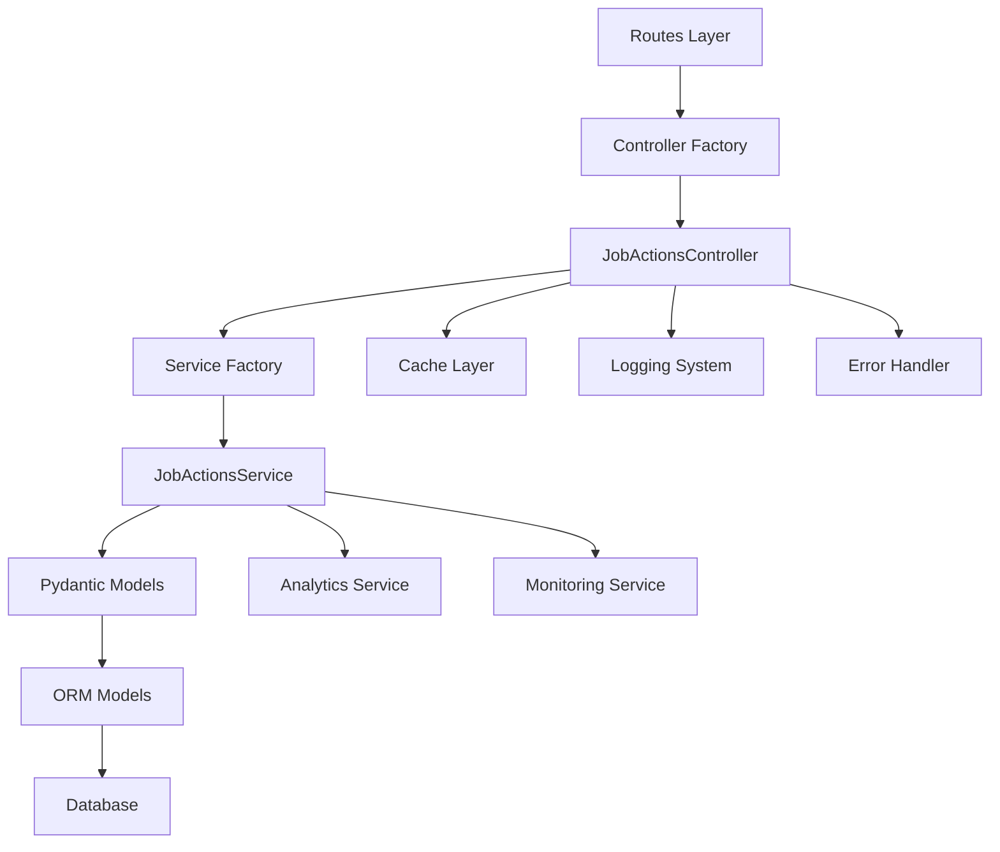

# Design Document

## Overview

The Job Actions Refactor addresses critical architectural violations in the existing job-actions implementation. The
current code deviates from our established patterns in several key areas: improper error handling, missing comprehensive
documentation, inconsistent factory pattern usage, and architectural violations. This refactor brings the codebase into
compliance with our structure file standards while maintaining all existing functionality.

## Architecture

### Current Issues Identified

1. **Controller Architecture Violations**
    - Missing comprehensive docstrings explaining method purposes and side effects
    - Inconsistent error handling patterns
    - Direct dictionary returns instead of standardized result objects
    - Missing proper Flask integration patterns

2. **Service Layer Issues**
    - Services not following the established interface pattern
    - Missing service factory registration
    - Inconsistent error handling and result formats

3. **Data Flow Violations**
    - Some operations bypass proper Pydantic validation
    - Inconsistent ORM to Pydantic conversion patterns
    - Missing validation in some data transformation paths

4. **Documentation Deficiencies**
    - Missing class-level docstrings explaining architectural role
    - Insufficient inline comments for complex business logic
    - Missing parameter and return value documentation

5. **Performance and Caching Issues**
    - Inconsistent cache usage patterns
    - Missing cache invalidation strategies
    - Potential N+1 query issues in some operations

### Refactored Architecture



## Components and Interfaces

### Refactored JobActionsController

**Location**: `src/controllers/jobs/actions.py`
**Purpose**: Properly architected controller following all established patterns

```python
class JobActionsController(Controllers):
    """
    Controller for job interaction actions (likes, saves, shares).
    
    This controller manages user interactions with job postings, providing
    functionality for liking, saving, and sharing jobs. It follows the
    established MVC architecture with proper error handling, caching,
    and analytics integration.
    
    Architecture Integration:
        - Inherits from Controllers base class for session management
        - Uses factory pattern for dependency injection
        - Implements standardized error handling with @error_handler
        - Integrates with caching layer for performance optimization
        - Provides analytics tracking for business intelligence
    
    Dependencies:
        - JobActionsService: Core business logic implementation
        - JobActionsAnalyticsService: User engagement tracking
        - Cache layer: Performance optimization
        - Logging system: Audit trail and debugging
    """
    
    def __init__(self, factory):
        """
        Initialize JobActionsController with dependency injection.
        
        Args:
            factory: ControllerFactory instance for accessing other controllers
        """
        super().__init__(factory)
        self.job_actions_service = None
        self.analytics_service = None
        
    def init_app(self, app: Flask):
        """
        Initialize controller with Flask application context.
        
        Sets up service dependencies and integrates with application
        monitoring systems.
        
        Args:
            app: Flask application instance
        """
        super().init_app(app)
        # Service initialization following factory pattern
        
    @error_handler
    async def like_job(self, user_id: str, job_id: str) -> JobActionResult:
        """
        Like a job for a user with comprehensive validation and tracking.
        
        This method handles the complete job liking workflow including
        validation, duplicate checking, database persistence, cache
        invalidation, and analytics tracking.
        
        Args:
            user_id: JobSeeker profile user_uid (validated UUID string)
            job_id: Job ID to like (validated UUID string)
            
        Returns:
            JobActionResult: Standardized result object containing:
                - success: Boolean indicating operation success
                - message: Human-readable status message
                - data: Dictionary with like_id and updated like_count
                - error_code: Optional error code for client handling
                
        Raises:
            ValidationError: When input parameters are invalid
            DatabaseError: When database operations fail
            CacheError: When cache operations fail (non-blocking)
            
        Side Effects:
            - Creates JobLikeORM record in database
            - Invalidates related cache entries
            - Triggers analytics event tracking
            - Updates job engagement metrics
            
        Business Rules:
            - User must have valid JobSeeker profile
            - Job must exist and be active
            - Duplicate likes are prevented (409 error)
            - Anonymous users cannot like jobs
        """
```

### Service Layer Refactoring

**New Service**: `src/services/job_actions_service.py`

```python
class JobActionsService(ServiceInterface):
    """
    Service for job actions business logic implementation.
    
    This service encapsulates all business logic for job interactions
    including validation, persistence, and business rule enforcement.
    Follows the established service interface pattern for consistency.
    """
    
    def __init__(self, session_factory):
        super().__init__()
        self.session_factory = session_factory
        self.__interface_map = {
            'like_job': self._like_job,
            'unlike_job': self._unlike_job,
            'save_job': self._save_job,
            'unsave_job': self._unsave_job,
            'share_job': self._share_job,
            'get_actions_state': self._get_actions_state
        }
```

### Standardized Result Objects

**New Models**: `src/database/models/job_actions_results.py`

```python
class JobActionResult(BaseModel):
    """Standardized result object for job actions"""
    success: bool
    message: str
    data: Optional[Dict[str, Any]] = None
    error_code: Optional[str] = None
    timestamp: AwareDatetime = Field(default_factory=utc_time)
    
    model_config = ConfigDict(from_attributes=True)

class JobActionsStateResult(BaseModel):
    """Result object for job actions state queries"""
    success: bool
    message: str
    actions_state: Optional[JobActionsState] = None
    error_code: Optional[str] = None
    
    model_config = ConfigDict(from_attributes=True)
```

## Error Handling

### Standardized Error Handling Pattern

```python
@error_handler
async def controller_method(self, param: str) -> JobActionResult:
    """
    Controller method with proper error handling.
    
    This method demonstrates the proper error handling pattern
    that should be used throughout the job actions system.
    """
    try:
        # Input validation using Pydantic
        validated_input = InputModel(param=param)
        
        # Business logic through service layer
        service_result = await self.job_actions_service.execute(
            'action_name', 
            **validated_input.model_dump()
        )
        
        # Return standardized result
        return JobActionResult(
            success=service_result.success,
            message=service_result.message,
            data=service_result.data
        )
        
    except ValidationError as e:
        # Pydantic validation errors
        self.logger.warning(f"Validation error in {self.__class__.__name__}: {e}")
        return JobActionResult(
            success=False,
            message="Invalid input parameters",
            error_code="VALIDATION_ERROR"
        )
        
    except DatabaseError as e:
        # Database operation errors
        self.logger.error(f"Database error in {self.__class__.__name__}: {e}")
        return JobActionResult(
            success=False,
            message="Database operation failed",
            error_code="DATABASE_ERROR"
        )
        
    except Exception as e:
        # Unexpected errors
        self.logger.error(f"Unexpected error in {self.__class__.__name__}: {e}")
        return JobActionResult(
            success=False,
            message="Internal server error",
            error_code="INTERNAL_ERROR"
        )
```

## Testing Strategy

### Unit Testing Requirements

1. **Controller Tests**: Test all controller methods with proper mocking
2. **Service Tests**: Test business logic with database integration
3. **Model Tests**: Test Pydantic validation and computed properties
4. **Error Handling Tests**: Test all error scenarios and edge cases

### Integration Testing Requirements

1. **API Endpoint Tests**: Test complete request/response cycles
2. **Database Integration**: Test ORM operations and constraints
3. **Cache Integration**: Test cache operations and invalidation
4. **Analytics Integration**: Test event tracking and metrics

## Performance Optimization

### Caching Strategy

```python
class JobActionsCacheManager:
    """
    Centralized cache management for job actions.
    
    Provides consistent caching patterns and invalidation
    strategies for all job actions operations.
    """
    
    def __init__(self, redis_client):
        self.redis = redis_client
        self.cache_ttl = 3600  # 1 hour default
        
    async def get_job_actions_state(self, user_id: str, job_id: str) -> Optional[JobActionsState]:
        """Get cached job actions state with proper error handling"""
        
    async def invalidate_user_actions(self, user_id: str):
        """Invalidate all cached data for a user"""
        
    async def invalidate_job_engagement(self, job_id: str):
        """Invalidate job engagement statistics"""
```

### Database Optimization

1. **Query Optimization**: Eliminate N+1 queries with proper joins
2. **Index Usage**: Ensure all queries use appropriate indexes
3. **Connection Pooling**: Proper session management and pooling
4. **Batch Operations**: Optimize bulk operations where applicable

## Security Considerations

### Input Validation

1. **Pydantic Models**: All inputs validated through Pydantic models
2. **SQL Injection Prevention**: Use ORM for all database operations
3. **Rate Limiting**: Implement proper rate limiting for actions
4. **Authentication**: Verify user authentication for protected actions

### Audit Logging

1. **Security Events**: Log all security-related events
2. **User Actions**: Comprehensive audit trail for user actions
3. **Error Logging**: Detailed error logging with context
4. **Performance Monitoring**: Track performance metrics and alerts