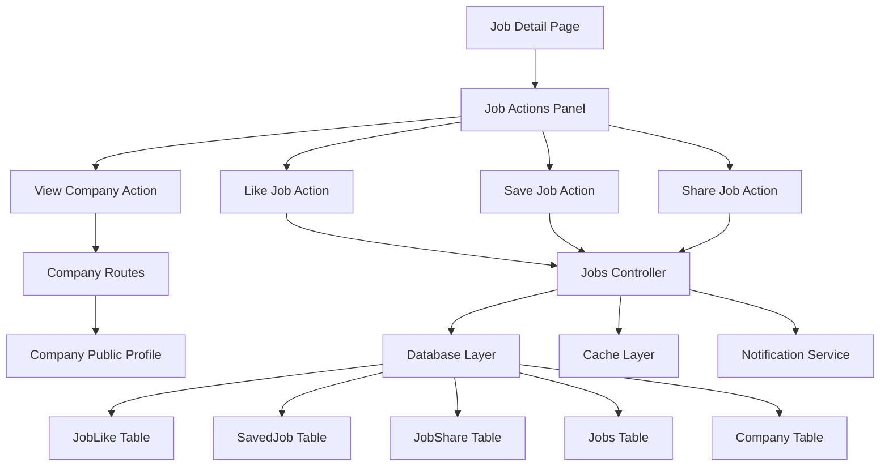

# Design Document

## Overview

The Job Actions feature extends the Job Finders platform by adding interactive capabilities for job seekers to engage
with job listings. This feature integrates seamlessly with the existing Flask-SQLAlchemy architecture, providing four
core actions: viewing company profiles, liking jobs, saving jobs, and sharing jobs. The design follows the established
MVC pattern with Pydantic models for data validation and SQLAlchemy ORM for database operations.

## Architecture

### System Integration Points

The job actions feature integrates with several existing system components:

- **Authentication System**: Leverages existing Flask authentication for user validation
- **Job Management**: Extends the existing `JobsWorkflowController` in `src/controllers/jobs/workflow.py`
- **Company System**: Utilizes existing `Company` and `CompanyORM` models for company profile display
- **User Management**: Integrates with existing `User` and `UserORM` models
- **Caching Layer**: Uses existing Redis cache for performance optimization
- **Email System**: Leverages existing Resend integration for notifications

### Architecture Diagram



## Components and Interfaces

### Frontend Components

#### Job Actions Panel Component

**Location**: `template/jobs/job-detail.html`
**Purpose**: Centralized UI component containing all job action buttons

```html
<div class="job-actions-panel">
    <button class="action-btn company-btn" onclick="viewCompany('{{ job.company_id }}')">
        <i class="fas fa-building"></i> View Company
    </button>
    <button class="action-btn like-btn {{ 'active' if user_has_liked else '' }}" 
            onclick="toggleLike('{{ job.job_id }}')">
        <i class="fas fa-heart"></i> 
        <span class="like-count">{{ job.like_count }}</span>
    </button>
    <button class="action-btn save-btn {{ 'active' if user_has_saved else '' }}" 
            onclick="toggleSave('{{ job.job_id }}')">
        <i class="fas fa-bookmark"></i> Save Job
    </button>
    <button class="action-btn share-btn" onclick="openShareModal('{{ job.job_id }}')">
        <i class="fas fa-share"></i> Share
    </button>
</div>
```

#### Share Modal Component

**Location**: `template/components/share-modal.html`
**Purpose**: Modal dialog for job sharing options

### Backend Components

#### Extended Jobs Controller

**Location**: `src/controllers/jobs/actions.py`
**Purpose**: New controller extending existing job functionality

```python
class JobActionsController(Controllers):
    """Controller for job interaction actions"""
    
    async def like_job(self, user_id: str, job_id: str) -> dict
    async def unlike_job(self, user_id: str, job_id: str) -> dict
    async def save_job(self, user_id: str, job_id: str) -> dict
    async def unsave_job(self, user_id: str, job_id: str) -> dict
    async def share_job(self, user_id: str, job_id: str, share_method: str) -> dict
    async def get_job_actions_state(self, user_id: str, job_id: str) -> dict
```

#### Company Public Profile Controller

**Location**: `src/controllers/company/public.py`
**Purpose**: Handle public company profile display

```python
class CompanyPublicController(Controllers):
    """Controller for public company profiles"""
    
    async def get_public_profile(self, company_id: str) -> Company
    async def get_company_active_jobs(self, company_id: str) -> list[Job]
    async def get_company_statistics(self, company_id: str) -> dict
```

### Route Definitions

#### Job Actions Routes

**Location**: `src/routes/jobs_routes/actions.py`

```python
@jobs_actions_bp.route('/api/jobs/<job_id>/like', methods=['POST', 'DELETE'])
@jobs_actions_bp.route('/api/jobs/<job_id>/save', methods=['POST', 'DELETE'])
@jobs_actions_bp.route('/api/jobs/<job_id>/share', methods=['POST'])
@jobs_actions_bp.route('/api/jobs/<job_id>/actions', methods=['GET'])
```

#### Company Public Routes

**Location**: `src/routes/company_routes/public.py`

```python
@company_public_bp.route('/company/<company_id>')
@company_public_bp.route('/company/<company_id>/jobs')
```

## Data Models

### New Database Tables

#### JobLike Table

```sql
CREATE TABLE job_likes (
    like_id VARCHAR(36) PRIMARY KEY,
    user_id VARCHAR(36) NOT NULL,
    job_id VARCHAR(36) NOT NULL,
    created_at TIMESTAMP DEFAULT CURRENT_TIMESTAMP,
    FOREIGN KEY (user_id) REFERENCES users(uid),
    FOREIGN KEY (job_id) REFERENCES jobs(job_id),
    UNIQUE KEY unique_user_job_like (user_id, job_id)
);
```

#### JobShare Table

```sql
CREATE TABLE job_shares (
    share_id VARCHAR(36) PRIMARY KEY,
    user_id VARCHAR(36),
    job_id VARCHAR(36) NOT NULL,
    share_method VARCHAR(50) NOT NULL,
    shared_at TIMESTAMP DEFAULT CURRENT_TIMESTAMP,
    referral_code VARCHAR(20),
    FOREIGN KEY (user_id) REFERENCES users(uid),
    FOREIGN KEY (job_id) REFERENCES jobs(job_id)
);
```

### Pydantic Models

#### JobLike Model

```python
class JobLike(BaseModel):
    like_id: str = Field(default_factory=lambda: str(uuid.uuid4()))
    user_id: str
    job_id: str
    created_at: AwareDatetime = Field(default_factory=utc_time)
    
    model_config = ConfigDict(from_attributes=True)
```

#### JobShare Model

```python
class JobShare(BaseModel):
    share_id: str = Field(default_factory=lambda: str(uuid.uuid4()))
    user_id: Optional[str] = None
    job_id: str
    share_method: str = Field(pattern="email|linkedin|twitter|facebook|whatsapp|copy_link")
    shared_at: AwareDatetime = Field(default_factory=utc_time)
    referral_code: Optional[str] = None
    
    model_config = ConfigDict(from_attributes=True)
```

#### JobActionsState Model

```python
class JobActionsState(BaseModel):
    job_id: str
    user_has_liked: bool = False
    user_has_saved: bool = False
    like_count: int = 0
    share_count: int = 0
    
    model_config = ConfigDict(from_attributes=True)
```

### Extended Existing Models

#### Enhanced Job Model

Add computed properties to existing `Job` model:

```python
@computed_field
@property
def like_count(self) -> int:
    """Total number of likes for this job"""
    return len(self.likes) if hasattr(self, 'likes') else 0

@computed_field  
@property
def share_count(self) -> int:
    """Total number of shares for this job"""
    return len(self.shares) if hasattr(self, 'shares') else 0
```

### SQLAlchemy ORM Models

#### JobLikeORM

```python
class JobLikeORM(Base):
    __tablename__ = 'job_likes'
    
    like_id = Column(String(36), primary_key=True)
    user_id = Column(String(36), ForeignKey('users.uid'), nullable=False)
    job_id = Column(String(36), ForeignKey('jobs.job_id'), nullable=False)
    created_at = Column(DateTime(timezone=True), default=utc_time)
    
    # Relationships
    user = relationship("UserORM", back_populates="liked_jobs")
    job = relationship("JobsORM", back_populates="likes")
    
    __table_args__ = (
        UniqueConstraint('user_id', 'job_id', name='unique_user_job_like'),
    )
```

#### JobShareORM

```python
class JobShareORM(Base):
    __tablename__ = 'job_shares'
    
    share_id = Column(String(36), primary_key=True)
    user_id = Column(String(36), ForeignKey('users.uid'), nullable=True)
    job_id = Column(String(36), ForeignKey('jobs.job_id'), nullable=False)
    share_method = Column(String(50), nullable=False)
    shared_at = Column(DateTime(timezone=True), default=utc_time)
    referral_code = Column(String(20), nullable=True)
    
    # Relationships
    user = relationship("UserORM", back_populates="shared_jobs")
    job = relationship("JobsORM", back_populates="shares")
```

## Error Handling

### API Error Responses

#### Standard Error Format

```python
class APIError(BaseModel):
    error: str
    message: str
    code: int
    details: Optional[dict] = None
```

#### Error Scenarios

1. **Authentication Errors**
    - 401: User not authenticated
    - 403: User not authorized for action

2. **Validation Errors**
    - 400: Invalid job_id or user_id
    - 404: Job or user not found
    - 409: Duplicate action (already liked/saved)

3. **Rate Limiting Errors**
    - 429: Too many requests (like/share spam prevention)

4. **Server Errors**
    - 500: Database connection issues
    - 503: Service temporarily unavailable

### Error Handling Implementation

```python
@error_handler
async def like_job(self, user_id: str, job_id: str) -> dict:
    try:
        # Validation
        if not self._validate_user_and_job(user_id, job_id):
            return {"error": "Invalid user or job", "code": 400}
        
        # Check for existing like
        if await self._user_has_liked_job(user_id, job_id):
            return {"error": "Job already liked", "code": 409}
        
        # Create like
        like = await self._create_job_like(user_id, job_id)
        return {"success": True, "like_id": like.like_id}
        
    except DatabaseError as e:
        self.logger.error(f"Database error in like_job: {e}")
        return {"error": "Database error", "code": 500}
    except Exception as e:
        self.logger.error(f"Unexpected error in like_job: {e}")
        return {"error": "Internal server error", "code": 500}
```

## Testing Strategy

### Unit Tests

#### Controller Tests

**Location**: `tests/controllers/test_job_actions.py`

```python
class TestJobActionsController:
    async def test_like_job_success(self):
        """Test successful job like"""
        
    async def test_like_job_duplicate(self):
        """Test duplicate like prevention"""
        
    async def test_save_job_success(self):
        """Test successful job save"""
        
    async def test_share_job_tracking(self):
        """Test job share tracking"""
```

#### Model Tests

**Location**: `tests/models/test_job_actions_models.py`

```python
class TestJobActionsModels:
    def test_job_like_validation(self):
        """Test JobLike model validation"""
        
    def test_job_share_validation(self):
        """Test JobShare model validation"""
```

### Integration Tests

#### API Endpoint Tests

**Location**: `tests/routes/test_job_actions_routes.py`

```python
class TestJobActionsRoutes:
    def test_like_job_endpoint(self):
        """Test POST /api/jobs/<job_id>/like"""
        
    def test_save_job_endpoint(self):
        """Test POST /api/jobs/<job_id>/save"""
        
    def test_share_job_endpoint(self):
        """Test POST /api/jobs/<job_id>/share"""
```

#### Database Integration Tests

**Location**: `tests/database/test_job_actions_db.py`

```python
class TestJobActionsDatabase:
    def test_job_like_crud_operations(self):
        """Test CRUD operations for job likes"""
        
    def test_saved_job_crud_operations(self):
        """Test CRUD operations for saved jobs"""
```

### Performance Tests

#### Load Testing

- Test concurrent like/save operations
- Test database performance with high volumes
- Test cache effectiveness for frequently accessed data

#### Stress Testing

- Test rate limiting effectiveness
- Test system behavior under spam conditions
- Test database connection pool under load

### Frontend Tests

#### JavaScript Unit Tests

**Location**: `static/js/tests/test_job_actions.js`

```javascript
describe('Job Actions', () => {
    test('toggleLike updates UI correctly', () => {
        // Test like button state changes
    });
    
    test('shareModal opens with correct data', () => {
        // Test share modal functionality
    });
});
```

#### End-to-End Tests

**Location**: `tests/e2e/test_job_actions_flow.py`

```python
class TestJobActionsE2E:
    def test_complete_job_actions_flow(self):
        """Test complete user flow through all job actions"""
```

## Security Considerations

### Authentication and Authorization

1. **User Authentication**: All job actions require authenticated users except sharing
2. **Rate Limiting**: Implement rate limiting to prevent spam and abuse
3. **Input Validation**: Validate all user inputs using Pydantic models
4. **SQL Injection Prevention**: Use SQLAlchemy ORM for all database operations

### Data Privacy

1. **Anonymous Sharing**: Allow job sharing without user authentication
2. **Personal Data Protection**: Don't expose personal information in public APIs
3. **Audit Logging**: Log all user actions for security monitoring

### Performance Security

1. **Cache Poisoning Prevention**: Validate cache keys and data
2. **Database Connection Security**: Use connection pooling and prepared statements
3. **Resource Limits**: Implement limits on concurrent operations per user

## Performance Optimization

### Caching Strategy

#### Redis Cache Implementation

```python
class JobActionsCacheService:
    def __init__(self, redis_client):
        self.redis = redis_client
        self.cache_ttl = 3600  # 1 hour
    
    async def get_job_actions_state(self, user_id: str, job_id: str) -> Optional[dict]:
        cache_key = f"job_actions:{user_id}:{job_id}"
        cached_data = await self.redis.get(cache_key)
        return json.loads(cached_data) if cached_data else None
    
    async def set_job_actions_state(self, user_id: str, job_id: str, state: dict):
        cache_key = f"job_actions:{user_id}:{job_id}"
        await self.redis.setex(cache_key, self.cache_ttl, json.dumps(state))
```

#### Cache Invalidation Strategy

- Invalidate user-specific cache on like/save actions
- Invalidate job-specific cache on job updates
- Use cache versioning for gradual rollouts

### Database Optimization

#### Indexing Strategy

```sql
-- Optimize job likes queries
CREATE INDEX idx_job_likes_user_job ON job_likes(user_id, job_id);
CREATE INDEX idx_job_likes_job_created ON job_likes(job_id, created_at);

-- Optimize saved jobs queries  
CREATE INDEX idx_saved_jobs_user_saved ON saved_jobs(user_id, saved_at);
CREATE INDEX idx_saved_jobs_job_saved ON saved_jobs(job_id, saved_at);

-- Optimize job shares queries
CREATE INDEX idx_job_shares_job_method ON job_shares(job_id, share_method);
CREATE INDEX idx_job_shares_shared_at ON job_shares(shared_at);
```

#### Query Optimization

- Use database-level aggregations for counts
- Implement pagination for large result sets
- Use EXISTS queries instead of COUNT for boolean checks

### Frontend Performance

#### JavaScript Optimization

- Debounce rapid click events
- Use event delegation for dynamic content
- Implement loading states for better UX

#### CSS Optimization

- Use CSS transitions for smooth state changes
- Optimize icon loading with sprite sheets
- Implement responsive design for mobile performance

## Monitoring and Analytics

### Metrics Collection

#### User Engagement Metrics

- Like rates per job category
- Save rates by user demographics
- Share conversion rates by platform
- Time spent on company profiles

#### System Performance Metrics

- API response times for each action
- Database query performance
- Cache hit rates
- Error rates by endpoint

### Analytics Implementation

```python
class JobActionsAnalytics:
    def track_job_action(self, action_type: str, user_id: str, job_id: str, metadata: dict):
        """Track job action for analytics"""
        event = {
            'event_type': f'job_{action_type}',
            'user_id': user_id,
            'job_id': job_id,
            'timestamp': utc_time(),
            'metadata': metadata
        }
        # Send to analytics service
        self.analytics_service.track(event)
```

### Dashboard Integration

#### Employer Analytics

- Show job engagement metrics in employer dashboard
- Display like/save trends over time
- Provide insights on job performance

#### Admin Analytics

- Monitor system usage patterns
- Track feature adoption rates
- Identify potential abuse patterns