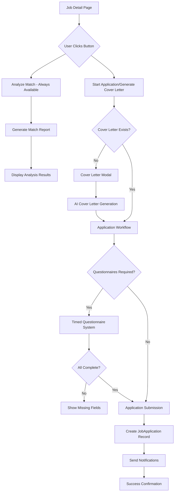

# Design Document

## Overview

The Job Application Process feature creates a comprehensive, guided workflow that transforms the job application experience from a simple button click into an intelligent, multi-step process. The system integrates AI-powered cover letter generation, job match analysis, questionnaire handling, and pre-interview assessments while leveraging existing infrastructure including the employee agents controller, job models, and application tracking system.

The design follows the platform's established patterns: Pydantic models for validation, SQLAlchemy ORM for persistence, controller factory pattern for dependency injection, and service-oriented architecture for business logic.

## Architecture

### High-Level Flow



### Component Architecture

The system consists of several key components that work together:

1. **Frontend Components**: Modal dialogs, progress indicators, form validation
2. **Route Handlers**: RESTful endpoints for application workflow
3. **Controllers**: Business logic coordination and validation
4. **Services**: External integrations and complex operations
5. **Data Models**: Pydantic validation and SQLAlchemy persistence
6. **AI Integration**: Cover letter generation and match analysis

## Components and Interfaces

### Frontend Components

#### Cover Letter Modal Component
```javascript
class CoverLetterModal {
    constructor(jobId, userId) {
        this.jobId = jobId;
        this.userId = userId;
        this.toneOptions = ['professional', 'enthusiastic', 'friendly', 'formal', 'concise'];
    }
    
    async generateCoverLetter(draft, tone, cvId) {
        // Call existing employee agents endpoint
        return await fetch(`/agents/employee/v1/jobs/${this.jobId}/cover-letter`, {
            method: 'POST',
            headers: { 'Content-Type': 'application/json' },
            body: JSON.stringify({ tone, cv_id: cvId, draft })
        });
    }
}
```

#### Application Progress Component
```javascript
class ApplicationProgress {
    constructor(steps) {
        this.steps = steps; // ['Cover Letter', 'Questionnaires', 'Review', 'Submit']
        this.currentStep = 0;
    }
    
    updateProgress(stepIndex) {
        this.currentStep = stepIndex;
        this.renderProgressBar();
    }
}
```

#### Questionnaire Timer Component
```javascript
class QuestionnaireTimer {
    constructor(timeLimit) {
        this.timeLimit = timeLimit; // in minutes
        this.startTime = Date.now();
        this.warningThreshold = 5; // minutes
    }
    
    startTimer() {
        this.interval = setInterval(() => {
            this.updateDisplay();
            this.checkWarnings();
        }, 1000);
    }
}
```

### Route Handlers

#### Application Workflow Routes
```python
# src/routes/jobseeker_routes/application_workflow.py

from flask import Blueprint, request, jsonify, session
from src.authentication import jobseeker_login
from src.utils.route_helpers import get_controller

application_workflow_bp = Blueprint('application_workflow', __name__, 
                                  url_prefix='/api/applications/workflow')

@application_workflow_bp.route('/jobs/<job_id>/start', methods=['POST'])
@jobseeker_login
async def start_application_process(user: User, job_id: str):
    """Start the application process for a job"""
    controller = get_controller('application_workflow')
    result = await controller.start_application_process(
        user_id=user.id,
        job_id=job_id
    )
    return jsonify(result.model_dump()), 200 if result.success else 400

@application_workflow_bp.route('/jobs/<job_id>/questionnaires', methods=['GET'])
@jobseeker_login
async def get_job_questionnaires(user: User, job_id: str):
    """Get required questionnaires for a job"""
    controller = get_controller('application_workflow')
    result = await controller.get_job_questionnaires(job_id=job_id)
    return jsonify(result.model_dump()), 200

@application_workflow_bp.route('/applications/<application_id>/questionnaires', methods=['POST'])
@jobseeker_login
async def submit_questionnaire_answers(user: User, application_id: str):
    """Submit questionnaire answers"""
    data = request.get_json()
    controller = get_controller('application_workflow')
    result = await controller.submit_questionnaire_answers(
        application_id=application_id,
        answers=data.get('answers', {}),
        user_id=user.id
    )
    return jsonify(result.model_dump()), 200 if result.success else 400

@application_workflow_bp.route('/applications/<application_id>/submit', methods=['POST'])
@jobseeker_login
async def submit_application(user: User, application_id: str):
    """Submit final application"""
    controller = get_controller('application_workflow')
    result = await controller.submit_application(
        application_id=application_id,
        user_id=user.id
    )
    return jsonify(result.model_dump()), 200 if result.success else 400
```

### Controllers

#### Application Workflow Controller
```python
# src/controllers/applications/application_workflow_controller.py

from typing import Optional, Dict, List
from src.controllers.controller import Controllers, error_handler
from src.database.models import (
    JobApplication, Job, User, ATSReport,
    ApplicationWorkflowResult, QuestionnaireResponse
)
from src.utils.route_helpers import get_controller

class ApplicationWorkflowController(Controllers):
    """Controller for managing the job application workflow"""
    
    def __init__(self, factory):
        super().__init__(factory)
    
    @error_handler
    async def start_application_process(
        self, 
        user_id: str, 
        job_id: str
    ) -> ApplicationWorkflowResult:
        """
        Start the application process for a user and job
        
        Returns:
            ApplicationWorkflowResult with next steps and application ID
        """
        # Check if user already applied
        existing_application = await self._check_existing_application(user_id, job_id)
        if existing_application:
            return ApplicationWorkflowResult(
                success=False,
                message="You have already applied for this job",
                application_id=existing_application.application_id
            )
        
        # Get job details
        job_controller = get_controller('jobs_search')
        job = await job_controller.get_job_by_id(job_id=job_id)
        
        if not job:
            return ApplicationWorkflowResult(
                success=False,
                message="Job not found"
            )
        
        # Check for existing cover letter
        cover_letter_exists = await self._check_cover_letter_exists(user_id, job_id)
        
        # Create draft application record
        with self.get_session() as session:
            application = JobApplicationORM(
                user_id=user_id,
                job_id=job_id,
                application_stage="DRAFT",
                method="website"
            )
            session.add(application)
            session.commit()
            
            return ApplicationWorkflowResult(
                success=True,
                application_id=application.application_id,
                next_step="cover_letter" if not cover_letter_exists else "questionnaires",
                cover_letter_exists=cover_letter_exists,
                questionnaires_required=bool(job.required_questionnaire)
            )
    
    @error_handler
    async def get_job_questionnaires(self, job_id: str) -> QuestionnaireResult:
        """Get questionnaires required for a job"""
        job_controller = get_controller('jobs_search')
        job = await job_controller.get_job_by_id(job_id=job_id)
        
        if not job or not job.required_questionnaire:
            return QuestionnaireResult(
                success=True,
                questionnaires=[],
                time_limit=0
            )
        
        # Load questionnaire definitions
        questionnaires = await self._load_questionnaires(job.required_questionnaire)
        
        return QuestionnaireResult(
            success=True,
            questionnaires=questionnaires,
            time_limit=30  # 30 minutes default
        )
    
    @error_handler
    async def submit_questionnaire_answers(
        self,
        application_id: str,
        answers: Dict[str, List[str]],
        user_id: str
    ) -> SubmissionResult:
        """Submit questionnaire answers for an application"""
        with self.get_session() as session:
            application = session.query(JobApplicationORM).filter_by(
                application_id=application_id,
                user_id=user_id
            ).first()
            
            if not application:
                return SubmissionResult(
                    success=False,
                    message="Application not found"
                )
            
            # Validate answers completeness
            validation_result = await self._validate_questionnaire_answers(
                application.job_id, answers
            )
            
            if not validation_result.is_complete:
                return SubmissionResult(
                    success=False,
                    message="Please complete all required questions",
                    missing_fields=validation_result.missing_fields
                )
            
            # Store answers
            application.questionnaire_answers = answers
            application.application_stage = "QUESTIONNAIRES_COMPLETE"
            session.commit()
            
            return SubmissionResult(
                success=True,
                message="Questionnaire answers saved successfully"
            )
    
    @error_handler
    async def submit_application(
        self,
        application_id: str,
        user_id: str
    ) -> SubmissionResult:
        """Submit final application"""
        with self.get_session() as session:
            application = session.query(JobApplicationORM).filter_by(
                application_id=application_id,
                user_id=user_id
            ).first()
            
            if not application:
                return SubmissionResult(
                    success=False,
                    message="Application not found"
                )
            
            # Final validation
            validation_result = await self._validate_final_application(application)
            if not validation_result.is_valid:
                return SubmissionResult(
                    success=False,
                    message="Application validation failed",
                    missing_requirements=validation_result.missing_requirements
                )
            
            # Update application status
            application.application_stage = JobApplicationStatusEnum.APPLIED.value
            application.applied_date = utc_time()
            application.validation_score = validation_result.score
            
            # Attach match analysis if exists
            await self._attach_match_analysis(application)
            
            session.commit()
            
            # Send notifications
            await self._send_application_notifications(application)
            
            return SubmissionResult(
                success=True,
                message="Application submitted successfully",
                application_id=application.application_id
            )
    
    async def _check_existing_application(self, user_id: str, job_id: str) -> Optional[JobApplication]:
        """Check if user already applied for this job"""
        with self.get_session() as session:
            existing = session.query(JobApplicationORM).filter_by(
                user_id=user_id,
                job_id=job_id
            ).filter(
                JobApplicationORM.application_stage != "DRAFT"
            ).first()
            
            return JobApplication(**existing.to_dict()) if existing else None
    
    async def _check_cover_letter_exists(self, user_id: str, job_id: str) -> bool:
        """Check if user has generated a cover letter for this job"""
        # Implementation depends on how cover letters are stored
        # This could be in a separate table or cached
        return False  # Placeholder
    
    async def _attach_match_analysis(self, application: JobApplicationORM):
        """Attach the most recent match analysis report to application"""
        with self.get_session() as session:
            # Find most recent ATS report for this user/job combination
            ats_report = session.query(ATSReportORM).filter_by(
                job_id=application.job_id,
                cv_id=application.cv_id
            ).order_by(ATSReportORM.created_at.desc()).first()
            
            if ats_report:
                application.ats_report_id = ats_report.ats_report_id
```

## Data Models

### Pydantic Models

#### Application Workflow Models
```python
# src/database/models/application_workflow.py

from pydantic import BaseModel, Field
from typing import Optional, List, Dict
from datetime import datetime

class ApplicationWorkflowResult(BaseModel):
    """Result of starting application workflow"""
    success: bool
    message: Optional[str] = None
    application_id: Optional[str] = None
    next_step: Optional[str] = None  # 'cover_letter', 'questionnaires', 'review'
    cover_letter_exists: bool = False
    questionnaires_required: bool = False

class QuestionnaireQuestion(BaseModel):
    """Individual questionnaire question"""
    question_id: str
    question_text: str
    question_type: str = Field(pattern="^(multiple_choice|text|boolean|rating)$")
    required: bool = True
    options: Optional[List[str]] = None  # For multiple choice
    max_length: Optional[int] = None  # For text questions

class Questionnaire(BaseModel):
    """Questionnaire definition"""
    questionnaire_id: str
    title: str
    description: Optional[str] = None
    time_limit: int = Field(ge=5, le=120)  # 5-120 minutes
    questions: List[QuestionnaireQuestion]

class QuestionnaireResult(BaseModel):
    """Result of questionnaire retrieval"""
    success: bool
    questionnaires: List[Questionnaire]
    time_limit: int  # Total time limit in minutes
    message: Optional[str] = None

class ValidationResult(BaseModel):
    """Result of validation checks"""
    is_valid: bool = True
    is_complete: bool = True
    score: int = Field(ge=0, le=100, default=0)
    missing_fields: List[str] = Field(default_factory=list)
    missing_requirements: List[str] = Field(default_factory=list)

class SubmissionResult(BaseModel):
    """Result of application submission"""
    success: bool
    message: str
    application_id: Optional[str] = None
    missing_fields: Optional[List[str]] = None
    missing_requirements: Optional[List[str]] = None

class CoverLetterSession(BaseModel):
    """Cover letter generation session"""
    session_id: str = Field(default_factory=lambda: str(uuid.uuid4()))
    user_id: str
    job_id: str
    draft_text: Optional[str] = None
    selected_tone: str = Field(default="professional")
    generated_letter: Optional[str] = None
    created_at: datetime = Field(default_factory=datetime.utcnow)
    expires_at: datetime = Field(default_factory=lambda: datetime.utcnow() + timedelta(hours=24))
```

### Enhanced JobApplication Model
```python
# Additions to existing JobApplication model in jobs_model.py

class JobApplication(BaseModel):
    # ... existing fields ...
    
    # New fields for workflow
    workflow_step: str = Field(default="draft")  # draft, cover_letter, questionnaires, review, submitted
    cover_letter_session_id: Optional[str] = None
    questionnaire_start_time: Optional[datetime] = None
    questionnaire_completion_time: Optional[datetime] = None
    time_spent_on_questionnaires: Optional[int] = None  # seconds
    
    # Enhanced validation
    @property
    def workflow_completion_percentage(self) -> int:
        """Calculate workflow completion percentage"""
        steps = {
            'draft': 10,
            'cover_letter': 40,
            'questionnaires': 70,
            'review': 90,
            'submitted': 100
        }
        return steps.get(self.workflow_step, 0)
    
    @property
    def is_workflow_complete(self) -> bool:
        """Check if workflow is complete"""
        return self.workflow_step == 'submitted'
    
    @property
    def next_workflow_step(self) -> Optional[str]:
        """Get next step in workflow"""
        steps = ['draft', 'cover_letter', 'questionnaires', 'review', 'submitted']
        try:
            current_index = steps.index(self.workflow_step)
            return steps[current_index + 1] if current_index < len(steps) - 1 else None
        except ValueError:
            return 'cover_letter'
```

### SQLAlchemy ORM Extensions

#### Questionnaire ORM Models
```python
# src/database/sql/questionnaires.py

from sqlalchemy import Column, String, Text, Integer, Boolean, DateTime, ForeignKey
from sqlalchemy.orm import relationship
from src.database.sql import Base

class QuestionnaireORM(Base):
    """Questionnaire definition table"""
    __tablename__ = 'questionnaires'
    
    questionnaire_id = Column(String(36), primary_key=True)
    title = Column(String(255), nullable=False)
    description = Column(Text, nullable=True)
    time_limit = Column(Integer, default=30)  # minutes
    is_active = Column(Boolean, default=True)
    created_at = Column(DateTime, default=datetime.utcnow)
    
    questions = relationship("QuestionnaireQuestionORM", back_populates="questionnaire")

class QuestionnaireQuestionORM(Base):
    """Individual questionnaire questions"""
    __tablename__ = 'questionnaire_questions'
    
    question_id = Column(String(36), primary_key=True)
    questionnaire_id = Column(String(36), ForeignKey('questionnaires.questionnaire_id'))
    question_text = Column(Text, nullable=False)
    question_type = Column(String(20), nullable=False)  # multiple_choice, text, boolean, rating
    required = Column(Boolean, default=True)
    options = Column(Text, nullable=True)  # JSON for multiple choice options
    max_length = Column(Integer, nullable=True)
    order_index = Column(Integer, default=0)
    
    questionnaire = relationship("QuestionnaireORM", back_populates="questions")

class CoverLetterSessionORM(Base):
    """Cover letter generation sessions"""
    __tablename__ = 'cover_letter_sessions'
    
    session_id = Column(String(36), primary_key=True)
    user_id = Column(String(36), nullable=False)
    job_id = Column(String(36), nullable=False)
    draft_text = Column(Text, nullable=True)
    selected_tone = Column(String(20), default='professional')
    generated_letter = Column(Text, nullable=True)
    created_at = Column(DateTime, default=datetime.utcnow)
    expires_at = Column(DateTime, nullable=False)
```

## Error Handling

### Error Types and Responses

#### Application Workflow Errors
```python
class ApplicationWorkflowError(Exception):
    """Base exception for application workflow errors"""
    pass

class DuplicateApplicationError(ApplicationWorkflowError):
    """Raised when user tries to apply twice for same job"""
    pass

class QuestionnaireTimeoutError(ApplicationWorkflowError):
    """Raised when questionnaire time limit is exceeded"""
    pass

class CoverLetterGenerationError(ApplicationWorkflowError):
    """Raised when cover letter generation fails"""
    pass

class ValidationError(ApplicationWorkflowError):
    """Raised when application validation fails"""
    pass
```

#### Error Handling Patterns
```python
@error_handler
async def submit_application(self, application_id: str, user_id: str) -> SubmissionResult:
    """Submit application with comprehensive error handling"""
    try:
        # Application logic here
        pass
    except DuplicateApplicationError:
        return SubmissionResult(
            success=False,
            message="You have already applied for this job"
        )
    except QuestionnaireTimeoutError:
        return SubmissionResult(
            success=False,
            message="Questionnaire time limit exceeded. Please restart the application process."
        )
    except ValidationError as e:
        return SubmissionResult(
            success=False,
            message=f"Application validation failed: {str(e)}",
            missing_requirements=getattr(e, 'missing_requirements', [])
        )
    except Exception as e:
        self.logger.error(f"Unexpected error in submit_application: {e}")
        return SubmissionResult(
            success=False,
            message="An unexpected error occurred. Please try again."
        )
```

## Testing Strategy

### Unit Tests

#### Controller Tests
```python
# tests/controllers/test_application_workflow_controller.py

import pytest
from src.controllers.applications.application_workflow_controller import ApplicationWorkflowController
from src.database.models.application_workflow import ApplicationWorkflowResult

@pytest.fixture
def controller():
    return ApplicationWorkflowController(mock_factory)

@pytest.mark.asyncio
async def test_start_application_process_success(controller):
    """Test successful application process start"""
    result = await controller.start_application_process(
        user_id="test-user-123",
        job_id="test-job-456"
    )
    
    assert result.success is True
    assert result.application_id is not None
    assert result.next_step in ['cover_letter', 'questionnaires']

@pytest.mark.asyncio
async def test_start_application_duplicate_prevention(controller):
    """Test duplicate application prevention"""
    # First application
    await controller.start_application_process("test-user-123", "test-job-456")
    
    # Second application attempt
    result = await controller.start_application_process("test-user-123", "test-job-456")
    
    assert result.success is False
    assert "already applied" in result.message.lower()
```

#### Frontend Tests
```javascript
// tests/frontend/test_cover_letter_modal.js

describe('CoverLetterModal', () => {
    let modal;
    
    beforeEach(() => {
        modal = new CoverLetterModal('job-123', 'user-456');
    });
    
    test('should initialize with correct tone options', () => {
        expect(modal.toneOptions).toContain('professional');
        expect(modal.toneOptions).toContain('enthusiastic');
        expect(modal.toneOptions).toContain('friendly');
    });
    
    test('should generate cover letter with valid inputs', async () => {
        const mockResponse = { success: true, cover_letter: 'Generated letter' };
        global.fetch = jest.fn().mockResolvedValue({
            json: () => Promise.resolve(mockResponse)
        });
        
        const result = await modal.generateCoverLetter('Draft text', 'professional', 'cv-123');
        
        expect(fetch).toHaveBeenCalledWith(
            '/agents/employee/v1/jobs/job-123/cover-letter',
            expect.objectContaining({
                method: 'POST',
                body: JSON.stringify({
                    tone: 'professional',
                    cv_id: 'cv-123',
                    draft: 'Draft text'
                })
            })
        );
    });
});
```

### Integration Tests

#### End-to-End Workflow Tests
```python
# tests/integration/test_application_workflow.py

@pytest.mark.asyncio
async def test_complete_application_workflow(test_client, test_user, test_job):
    """Test complete application workflow from start to finish"""
    
    # Step 1: Start application process
    response = await test_client.post(
        f'/api/applications/workflow/jobs/{test_job.job_id}/start',
        headers={'Authorization': f'Bearer {test_user.token}'}
    )
    assert response.status_code == 200
    data = response.json()
    application_id = data['application_id']
    
    # Step 2: Generate cover letter (if needed)
    if data['next_step'] == 'cover_letter':
        cover_letter_response = await test_client.post(
            f'/agents/employee/v1/jobs/{test_job.job_id}/cover-letter',
            json={'tone': 'professional', 'cv_id': test_user.primary_cv_id},
            headers={'Authorization': f'Bearer {test_user.token}'}
        )
        assert cover_letter_response.status_code == 200
    
    # Step 3: Complete questionnaires (if required)
    questionnaire_response = await test_client.get(
        f'/api/applications/workflow/jobs/{test_job.job_id}/questionnaires',
        headers={'Authorization': f'Bearer {test_user.token}'}
    )
    
    if questionnaire_response.json()['questionnaires']:
        answers = {'question_1': ['Answer 1'], 'question_2': ['Answer 2']}
        submit_response = await test_client.post(
            f'/api/applications/workflow/applications/{application_id}/questionnaires',
            json={'answers': answers},
            headers={'Authorization': f'Bearer {test_user.token}'}
        )
        assert submit_response.status_code == 200
    
    # Step 4: Submit final application
    final_response = await test_client.post(
        f'/api/applications/workflow/applications/{application_id}/submit',
        headers={'Authorization': f'Bearer {test_user.token}'}
    )
    assert final_response.status_code == 200
    assert final_response.json()['success'] is True
```

### Performance Tests

#### Load Testing
```python
# tests/performance/test_application_load.py

import asyncio
import time
from concurrent.futures import ThreadPoolExecutor

async def test_concurrent_applications():
    """Test system performance under concurrent application load"""
    
    async def submit_application(user_id, job_id):
        start_time = time.time()
        # Simulate application workflow
        result = await controller.start_application_process(user_id, job_id)
        end_time = time.time()
        return end_time - start_time
    
    # Test with 100 concurrent applications
    tasks = [
        submit_application(f'user-{i}', 'job-123') 
        for i in range(100)
    ]
    
    response_times = await asyncio.gather(*tasks)
    
    # Assert performance requirements
    avg_response_time = sum(response_times) / len(response_times)
    assert avg_response_time < 2.0  # Less than 2 seconds average
    assert max(response_times) < 5.0  # No request takes more than 5 seconds
```

This design provides a comprehensive, scalable solution that integrates seamlessly with the existing Job Finders platform architecture while delivering the enhanced application workflow experience outlined in the requirements.