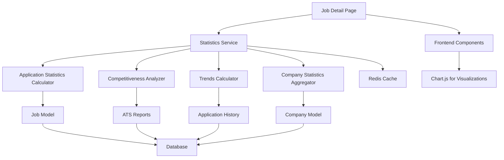

# Design Document

## Overview

This design document outlines the enhancement of the job detail page with comprehensive statistical information. The enhancement will add four new statistical sections to the existing job detail page: Application Statistics, Job Competitiveness, Job Trends, and Company Statistics. The implementation will leverage existing computed properties from the Job, JobApplication, and Company models while adding new statistical calculations and caching mechanisms for optimal performance.

## Architecture

### High-Level Architecture



### Data Flow

1. **Request Flow**: User visits job detail page → Controller fetches job data → Statistics service calculates metrics → Template renders with statistics
2. **Caching Strategy**: Statistics are cached in Redis with TTL based on data volatility
3. **Fallback Handling**: Graceful degradation when statistics are unavailable

## Components and Interfaces

### 1. Statistics Service (`src/services/job_statistics_service.py`)

**Purpose**: Central service for calculating and caching job-related statistics

```python
class JobStatisticsService:
    def __init__(self, redis_client, job_controller, company_controller):
        self.redis = redis_client
        self.job_controller = job_controller
        self.company_controller = company_controller
    
    async def get_job_statistics(self, job_id: str) -> JobStatistics:
        """Get comprehensive statistics for a job"""
        
    async def get_application_statistics(self, job: Job) -> ApplicationStatistics:
        """Calculate application-related statistics"""
        
    async def get_competitiveness_metrics(self, job: Job) -> CompetitivenessMetrics:
        """Calculate job competitiveness based on ATS data"""
        
    async def get_trend_analysis(self, job: Job) -> TrendAnalysis:
        """Calculate application trends over time"""
        
    async def get_company_statistics(self, company_id: str) -> CompanyStatistics:
        """Get company hiring statistics"""
```

### 2. Data Models (`src/database/models/job_statistics.py`)

**New Pydantic Models for Statistics**

```python
class ApplicationStatistics(BaseModel):
    total_applications: int
    applications_per_day: float
    application_sources: dict[str, int]
    recent_application_trend: str  # "increasing", "decreasing", "stable"

class CompetitivenessMetrics(BaseModel):
    match_score_distribution: dict[str, int]  # {"0-20": 5, "21-40": 10, ...}
    average_match_score: Optional[float]
    top_matched_keywords: list[str]
    top_missing_keywords: list[str]
    ats_readiness_percentage: float

class TrendAnalysis(BaseModel):
    daily_applications: list[dict]  # [{"date": "2025-01-01", "count": 5}, ...]
    application_velocity: str  # "accelerating", "decelerating", "steady"
    industry_comparison: dict  # {"this_job": 15, "industry_average": 12}
    peak_application_days: list[str]

class CompanyStatistics(BaseModel):
    total_jobs_12_months: int
    average_applications_per_job: float
    average_time_to_fill: Optional[float]
    application_response_rate: float
    hiring_activity_level: str  # "high", "medium", "low"

class JobStatistics(BaseModel):
    application_stats: ApplicationStatistics
    competitiveness: CompetitivenessMetrics
    trends: TrendAnalysis
    company_stats: CompanyStatistics
    calculated_at: AwareDatetime
```

### 3. Controller Enhancement (`src/controllers/jobs/job_search_controller.py`)

**Enhanced job_details method**

```python
async def get_job_with_statistics(self, job_id: str) -> tuple[Job, JobStatistics]:
    """Get job with comprehensive statistics"""
    job = await self.get_job_by_id(job_id)
    if not job:
        return None, None
    
    statistics_service = get_service('job_statistics')
    statistics = await statistics_service.get_job_statistics(job_id)
    
    return job, statistics
```

### 4. Template Components

**New template sections to be added to `template/jobs/job_detail.html`**

- Application Statistics Section (after Job Quality Insights)
- Job Competitiveness Section 
- Job Trends Section (with Chart.js visualizations)
- Company Statistics Section

### 5. Frontend Components

**JavaScript modules for interactive features**

- `static/js/jobs/statistics-charts.js` - Chart.js integration for trend visualization
- `static/js/jobs/statistics-tooltips.js` - Tooltip explanations for metrics
- `static/css/jobs/job-statistics.css` - Styling for statistics sections

## Data Models

### Database Schema Extensions

**No new tables required** - leveraging existing models:

- `Job` model: Use existing computed properties (`total_applications`, `job_ats_score`, etc.)
- `JobApplication` model: Use for application trends and statistics
- `Company` model: Use existing computed properties for company statistics
- `ATSReport` model: Use for competitiveness metrics

### Computed Properties Enhancement

**New computed properties to add to existing models:**

```python
# Job model additions
@computed_field
@property
def applications_per_day(self) -> float:
    """Calculate average applications per day since posting"""
    
@computed_field  
@property
def application_trend_direction(self) -> str:
    """Determine if applications are increasing/decreasing"""

# Company model additions
@computed_field
@property
def jobs_posted_last_12_months(self) -> int:
    """Count jobs posted in last 12 months"""
```

## Error Handling

### Graceful Degradation Strategy

1. **Missing Data**: Display "Data not available" messages with appropriate styling
2. **Calculation Errors**: Log errors and show fallback statistics
3. **Cache Failures**: Calculate statistics on-demand if cache is unavailable
4. **Performance Issues**: Implement timeouts and async calculation

### Error Scenarios

- **No Applications**: Show "0 applications" with encouraging messaging
- **No ATS Data**: Hide competitiveness section or show limited metrics
- **New Job**: Show "Trend data developing" for jobs posted < 7 days ago
- **Company Data Limited**: Show basic metrics only

## Testing Strategy

### Unit Tests

1. **Statistics Service Tests**
   - Test calculation accuracy for each statistic type
   - Test caching behavior and TTL
   - Test error handling and fallbacks

2. **Model Tests**
   - Test new computed properties
   - Test edge cases (no applications, no ATS data)

3. **Controller Tests**
   - Test enhanced job_details method
   - Test statistics integration

### Integration Tests

1. **End-to-End Tests**
   - Test complete job detail page with statistics
   - Test responsive design on mobile devices
   - Test chart rendering and interactions

2. **Performance Tests**
   - Test page load times with statistics
   - Test cache effectiveness
   - Test database query optimization

### Test Data Requirements

- Jobs with varying application counts (0, few, many)
- Jobs with and without ATS reports
- Companies with different activity levels
- Historical application data for trend testing

## Performance Considerations

### Caching Strategy

1. **Redis Caching**
   - Application statistics: 1-hour TTL
   - Competitiveness metrics: 4-hour TTL (ATS data changes less frequently)
   - Trend analysis: 6-hour TTL
   - Company statistics: 12-hour TTL

2. **Cache Keys**
   - `job_stats:{job_id}:applications`
   - `job_stats:{job_id}:competitiveness`
   - `job_stats:{job_id}:trends`
   - `company_stats:{company_id}`

### Database Optimization

1. **Query Optimization**
   - Use existing computed properties where possible
   - Implement efficient date range queries for trends
   - Add database indexes if needed for performance

2. **Async Processing**
   - Calculate complex statistics asynchronously
   - Use background tasks for heavy computations
   - Implement progressive loading for charts

### Frontend Performance

1. **Lazy Loading**
   - Load chart data after initial page render
   - Progressive enhancement for statistics sections

2. **Responsive Design**
   - Optimize chart rendering for mobile devices
   - Use CSS Grid for responsive statistics layout

## Security Considerations

### Data Privacy

1. **Sensitive Information**
   - Don't expose individual applicant data
   - Aggregate statistics only
   - Respect user privacy settings

2. **Access Control**
   - Statistics visible to all users (public job data)
   - No authentication required for viewing
   - Rate limiting on statistics API endpoints

### Input Validation

1. **Parameter Validation**
   - Validate job_id format and existence
   - Sanitize any user inputs for filtering
   - Prevent SQL injection in dynamic queries

## Implementation Phases

### Phase 1: Core Statistics Service
- Implement JobStatisticsService
- Add new Pydantic models
- Create basic calculation methods
- Add Redis caching

### Phase 2: Template Integration
- Enhance job detail template
- Add statistics sections
- Implement responsive design
- Add basic styling

### Phase 3: Advanced Features
- Add Chart.js visualizations
- Implement trend analysis
- Add interactive tooltips
- Performance optimization

### Phase 4: Testing & Polish
- Comprehensive testing
- Performance tuning
- Error handling refinement
- Documentation updates