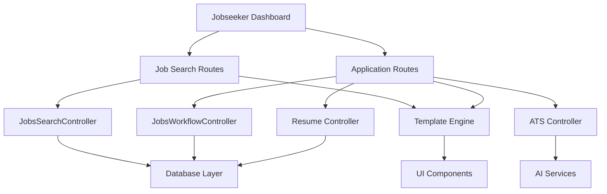

# Design Document

## Overview

This design document outlines the integration between the jobseeker dashboard interface and the existing job search functionality. The system leverages the existing MVC architecture with Flask routes, controllers, and Pydantic models to create a seamless job discovery and application workflow.

The integration focuses on connecting the dashboard's "Browse Jobs" button to live job listings, enabling job applications through an intelligent ATS-powered form, and providing comprehensive application tracking capabilities.

## Architecture

### High-Level Architecture



### Component Interaction Flow

1. **Dashboard → Job Browsing**: Dashboard quick actions redirect to job search routes
2. **Job Search → Job Details**: Job listings link to detailed job views with application capability
3. **Job Application**: Intelligent application form with ATS analysis and CV optimization
4. **Application Tracking**: Real-time dashboard updates and comprehensive application management

## Components and Interfaces

### 1. Route Layer Integration

#### Dashboard Routes Enhancement
- **Current**: `jobseeker_route.dashboard()` displays static dashboard
- **Enhancement**: Add dynamic data loading for application counts and saved jobs

#### Job Search Routes (Existing)
- `/jobs/browse-jobs` - Main job listing endpoint
- `/jobs/search` - Keyword-based job search
- `/jobs/<job_id>` - Individual job details with application capability
- `/jobs/category/<category>` - Category-filtered jobs
- `/jobs/location/<location>` - Location-filtered jobs

#### Application Routes (Existing)
- `/jobseeker/applications/jobs/apply/<job_id>` - Application form
- `/jobseeker/applications/submit/<job_id>` - Application submission
- `/jobseeker/applications/` - Application listing
- `/jobseeker/applications/<application_id>` - Individual application view

### 2. Controller Layer

#### JobsSearchController
**Existing Methods:**
- `get_all_jobs(page, page_size)` - Paginated job listings
- `search_jobs(keyword, page, page_size)` - Keyword search
- `get_job_by_id(job_id)` - Individual job retrieval
- `get_similar_jobs(job_id)` - Related job recommendations

**Enhancement Needed:**
- Dashboard statistics integration
- Real-time job count updates

#### JobsWorkflowController
**Existing Methods:**
- `apply_to_job(job_application)` - Process job applications
- `get_job_application_by_id(application_id)` - Retrieve applications
- `withdraw_job_application(application_id)` - Handle withdrawals

**Enhancement Needed:**
- Dashboard integration for application counts
- Real-time status updates

#### ATS Controller Integration
**Existing Functionality:**
- `evaluate_application(job, cv_id, cover_letter)` - ATS compatibility analysis
- `generate_cover_letter(job, cv)` - AI-powered cover letter generation
- `recommend_salary(job, use_ai)` - Salary recommendations

### 3. Data Models

#### Core Models (Existing)
```python
class Job(BaseModel):
    job_id: str
    title: str
    company: Company
    description: str
    requirements: List[str]
    salary_min: Optional[int]
    salary_max: Optional[int]
    location: str
    status: JobStatusEnum
    created_at: AwareDatetime
    expires_at: AwareDatetime

class JobApplication(BaseModel):
    application_id: str
    user_uid: str
    job_id: str
    cv_id: str
    cover_letter: str
    status: JobApplicationStatusEnum
    applied_at: AwareDatetime
    ats_score: Optional[float]

class JobSeekerProfile(BaseModel):
    user_uid: str
    first_name: str
    last_name: str
    applications: List[JobApplication]
    saved_jobs: List[SavedJob]
    resumes_list: List[JobSeekerCV]
```

#### Dashboard Statistics Model
```python
class DashboardStats(BaseModel):
    applications_count: int
    saved_jobs_count: int
    cv_uploaded: bool
    recent_applications: List[JobApplication]
    recommended_jobs: List[Job]
```

### 4. Template Integration

#### Dashboard Template Enhancement
**File**: `template/jobseekers/dashboard.html`
**Changes Needed:**
- Dynamic application count display
- Real-time saved jobs count
- Quick action button routing to correct endpoints

#### Job Listing Templates (Existing)
- `template/jobs/list.html` - Main job listings
- `template/jobs/job_detail.html` - Individual job view with apply button
- `template/jobs/search.html` - Search results

#### Application Templates (Existing)
- `template/jobseekers/apply.html` - Application form
- `template/jobseekers/applications/list.html` - Application history
- `template/jobseekers/applications/view.html` - Individual application view

## Data Models

### Enhanced Dashboard Context
```python
class DashboardContext(TypedDict):
    current_user: User
    seeker_stats: Dict[str, Any]
    recent_jobs: List[Job]
    application_summary: Dict[str, int]
    cv_status: Dict[str, bool]
```

### Application Flow Data
```python
class ApplicationContext(TypedDict):
    job: Job
    cvs: List[JobSeekerCV]
    best_ats_report: ATSReport
    selected_cv_id: str
    cover_letter: str
    salary_recommendation: Dict[str, Any]
    locations: List[str]
```

## Error Handling

### Route-Level Error Handling
- **404 Errors**: Job not found, application not found
- **403 Errors**: Unauthorized access to applications
- **400 Errors**: Invalid form data, duplicate applications
- **500 Errors**: Database connection issues, ATS service failures

### User Experience Error Handling
- **Graceful Degradation**: Show mock data when live jobs unavailable
- **Validation Feedback**: Real-time form validation with clear error messages
- **Retry Mechanisms**: Automatic retry for transient failures
- **Fallback Options**: Alternative paths when primary services fail

### Error Recovery Strategies
```python
# Example error handling pattern
@error_handler
async def apply_for_job(user: User, job_id: str):
    try:
        job = await job_search_controller.get_job_by_id(job_id)
        if not job:
            flash("Job not found", "danger")
            return redirect(url_for("jobs.browse_jobs"))
        
        # Continue with application logic
    except DatabaseError:
        flash("Service temporarily unavailable", "warning")
        return redirect(url_for("jobseekers.dashboard"))
    except ValidationError as e:
        flash(f"Invalid data: {str(e)}", "danger")
        return redirect(url_for("jobs.job_details", job_id=job_id))
```

## Testing Strategy

### Unit Testing
- **Controller Methods**: Test all CRUD operations and business logic
- **Model Validation**: Test Pydantic model validation and computed properties
- **Utility Functions**: Test helper functions and data transformations

### Integration Testing
- **Route Testing**: Test complete request/response cycles
- **Database Integration**: Test ORM operations and data consistency
- **Template Rendering**: Test context data and template output

### End-to-End Testing
- **User Workflows**: Test complete job search and application workflows
- **Dashboard Integration**: Test dashboard data accuracy and real-time updates
- **Error Scenarios**: Test error handling and recovery mechanisms

### Performance Testing
- **Database Queries**: Optimize pagination and search queries
- **ATS Processing**: Test ATS analysis performance with large datasets
- **Concurrent Users**: Test system behavior under load

### Test Data Strategy
```python
# Mock data for development and testing
def generate_test_jobs(count: int = 10) -> List[Job]:
    """Generate realistic test job data"""
    
def generate_test_applications(user_id: str, count: int = 5) -> List[JobApplication]:
    """Generate test application data"""
    
def setup_test_dashboard_data(user_id: str) -> DashboardStats:
    """Setup complete dashboard test scenario"""
```

## Security Considerations

### Authentication & Authorization
- **Route Protection**: All jobseeker routes require authentication
- **Application Access**: Users can only access their own applications
- **Data Isolation**: Strict user data separation in database queries

### Data Validation
- **Input Sanitization**: All form inputs validated and sanitized
- **SQL Injection Prevention**: Parameterized queries and ORM usage
- **XSS Protection**: Template auto-escaping and content validation

### Privacy Protection
- **PII Handling**: Secure handling of personal information
- **Data Retention**: Appropriate data lifecycle management
- **Audit Logging**: Track sensitive operations for compliance

## Performance Optimization

### Database Optimization
- **Query Optimization**: Efficient pagination and filtering
- **Index Strategy**: Proper indexing for search and filtering operations
- **Connection Pooling**: Efficient database connection management

### Caching Strategy
- **Job Listings**: Cache frequently accessed job data
- **User Sessions**: Efficient session management
- **Template Caching**: Cache rendered templates where appropriate

### Frontend Optimization
- **Lazy Loading**: Load application data on demand
- **Progressive Enhancement**: Core functionality works without JavaScript
- **Mobile Optimization**: Responsive design for mobile users