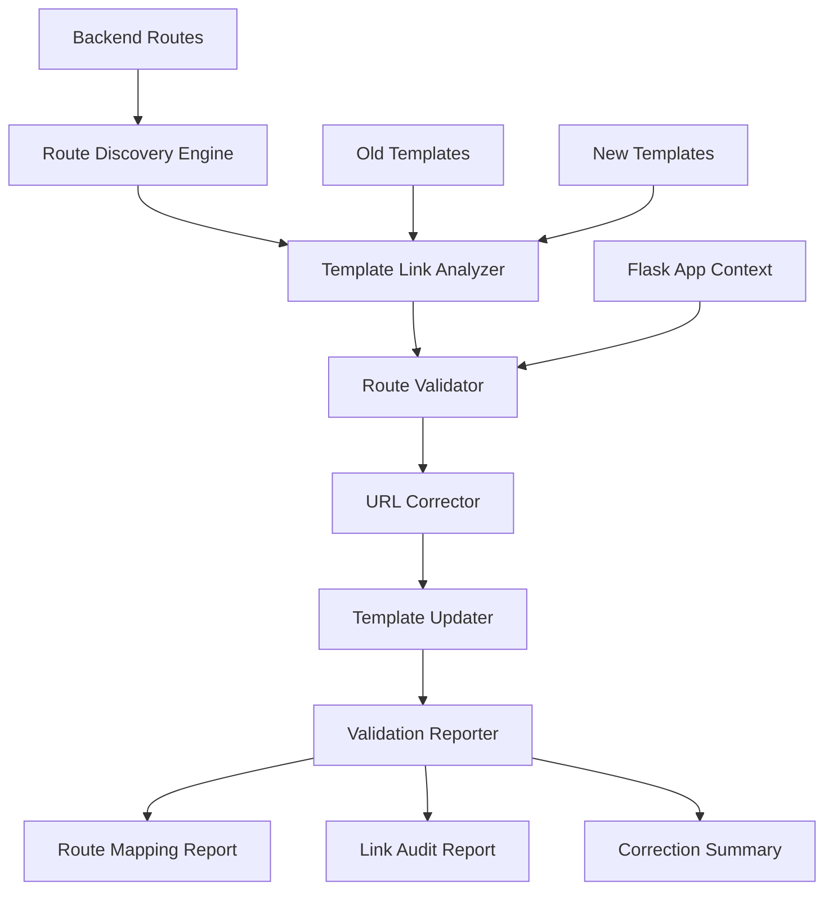

# Template Route Validation Design Document

## Overview

This design document outlines the approach for validating and correcting routing in the JobFinders template migration
project. The system will analyze existing backend routes, audit template links, and ensure proper Flask `url_for` usage
throughout the application.

## Architecture

### System Components



### Data Flow

1. **Route Discovery**: all routes can be found in this source src/routes/*
2. **Template Analysis**: Parse both old and new templates for links and forms
3. **Route Validation**: Match template links to existing backend routes
4. **URL Correction**: Convert hardcoded URLs to `url_for` syntax
5. **Template Update**: Apply corrections to new templates
6. **Validation Report**: Generate comprehensive reports on changes and issues

## Components and Interfaces

### 1. Route Discovery Engine

**Purpose**: Discover and catalog all Flask routes in the application.

**Interface**:

```python
class RouteDiscoveryEngine:
    def discover_routes(self, app: Flask) -> Dict[str, RouteInfo]
    def categorize_by_blueprint(self, routes: Dict) -> Dict[str, List[RouteInfo]]
    def extract_route_parameters(self, route: RouteInfo) -> List[str]
    def identify_auth_requirements(self, route: RouteInfo) -> AuthInfo
```

**Output**: Comprehensive route mapping with metadata

### 2. Template Link Analyzer

**Purpose**: Extract and analyze all links from template files.

**Interface**:

```python
class TemplateLinkAnalyzer:
    def extract_links(self, template_path: str) -> List[LinkInfo]
    def categorize_links(self, links: List[LinkInfo]) -> Dict[str, List[LinkInfo]]
    def identify_hardcoded_urls(self, links: List[LinkInfo]) -> List[LinkInfo]
    def compare_templates(self, old_path: str, new_path: str) -> ComparisonResult
```

**Output**: Detailed link inventory with categorization

### 3. Route Validator

**Purpose**: Validate template links against existing backend routes.

**Interface**:

```python
class RouteValidator:
    def validate_link(self, link: LinkInfo, routes: Dict[str, RouteInfo]) -> ValidationResult
    def find_matching_route(self, url: str, routes: Dict) -> Optional[RouteInfo]
    def suggest_corrections(self, invalid_link: LinkInfo) -> List[CorrectionSuggestion]
    def validate_parameters(self, link: LinkInfo, route: RouteInfo) -> bool
```

**Output**: Validation results with correction suggestions

### 4. URL Corrector

**Purpose**: Convert hardcoded URLs to proper Flask `url_for` syntax.

**Interface**:

```python
class URLCorrector:
    def generate_url_for(self, route: RouteInfo, parameters: Dict) -> str
    def convert_hardcoded_url(self, url: str, route: RouteInfo) -> str
    def handle_external_urls(self, url: str) -> str
    def apply_corrections(self, template: str, corrections: List[Correction]) -> str
```

**Output**: Corrected template content with proper routing

## Data Models

### RouteInfo

```python
@dataclass
class RouteInfo:
    endpoint: str
    rule: str
    methods: List[str]
    blueprint: Optional[str]
    view_function: str
    parameters: List[str]
    auth_required: bool
    roles_required: List[str]
    description: Optional[str]
```

### LinkInfo

```python
@dataclass
class LinkInfo:
    url: str
    element_type: str  # 'a', 'form', 'img', etc.
    context: str  # surrounding HTML context
    line_number: int
    file_path: str
    is_external: bool
    is_hardcoded: bool
    parameters: Dict[str, str]
```

### ValidationResult

```python
@dataclass
class ValidationResult:
    is_valid: bool
    matched_route: Optional[RouteInfo]
    issues: List[str]
    suggestions: List[CorrectionSuggestion]
    confidence_score: float
```

### CorrectionSuggestion

```python
@dataclass
class CorrectionSuggestion:
    original_url: str
    suggested_url_for: str
    route_info: RouteInfo
    required_parameters: List[str]
    confidence: float
    reasoning: str
```

## Route Mapping Strategy

### 1. Blueprint Organization

```python
BLUEPRINT_MAPPING = {
    'auth': ['login', 'register', 'logout', 'password_reset'],
    'jobs': ['job_list', 'job_detail', 'job_search', 'job_apply'],
    'company': ['company_profile', 'company_dashboard', 'job_posting'],
    'jobseeker': ['profile', 'applications', 'resume', 'job_alerts'],
    'admin': ['dashboard', 'users', 'jobs', 'companies'],
    'api': ['job_api', 'user_api', 'company_api'],
    'static': ['static_files', 'uploads']
}
```

### 2. Route Pattern Recognition

```python
ROUTE_PATTERNS = {
    r'/jobs/(\d+)': 'jobs.job_detail',
    r'/company/(\d+)': 'company.company_profile',
    r'/user/(\d+)': 'users.user_profile',
    r'/admin/(.+)': 'admin.{endpoint}',
    r'/api/(.+)': 'api.{endpoint}'
}
```

### 3. Parameter Extraction

```python
def extract_parameters(url: str, route_pattern: str) -> Dict[str, str]:
    """Extract parameters from URL based on route pattern"""
    # Implementation for parameter extraction
    pass
```

## Template Correction Process

### 1. Link Identification

```jinja2
<!-- Before: Hardcoded URLs -->
<a href="/jobs/123">View Job</a>
<form action="/jobs/apply" method="post">


<!-- After: url_for Usage -->
<a href="{{ url_for('jobs.job_detail', job_id=123) }}">View Job</a>
<form action="{{ url_for('jobs.apply_job') }}" method="post">

```

### 2. Conditional Routing

```jinja2
<!-- Authentication-based routing -->

    <a href="{{ url_for('jobseeker.dashboard') }}">Dashboard</a>

    <a href="{{ url_for('auth.login') }}">Login</a>


<!-- Role-based routing -->

    <a href="{{ url_for('admin.dashboard') }}">Admin Panel</a>

```

### 3. Parameter Handling

```jinja2
<!-- Dynamic parameters -->
<a href="{{ url_for('jobs.job_detail', job_id=job.id) }}">{{ job.title }}</a>
<a href="{{ url_for('company.company_profile', company_id=job.company_id) }}">{{ job.company_name }}</a>

<!-- Optional parameters -->
<a href="{{ url_for('jobs.job_search', category=category.slug if category else None) }}">Search Jobs</a>
```

## Error Handling

### 1. Route Not Found

```python
def handle_missing_route(link: LinkInfo) -> CorrectionSuggestion:
    """Handle cases where no matching route is found"""
    # Suggest closest matching routes
    # Provide manual review flags
    # Generate placeholder corrections
```

### 2. Parameter Mismatch

```python
def handle_parameter_mismatch(link: LinkInfo, route: RouteInfo) -> CorrectionSuggestion:
    """Handle cases where parameters don't match route requirements"""
    # Suggest parameter corrections
    # Provide default values where appropriate
    # Flag for manual review if complex
```

### 3. Authentication Issues

```python
def handle_auth_requirements(link: LinkInfo, route: RouteInfo) -> CorrectionSuggestion:
    """Handle authentication and authorization requirements"""
    # Add conditional rendering
    # Suggest login redirects
    # Implement role-based access
```

## Testing Strategy

### 1. Route Discovery Testing

- Verify all Flask routes are discovered
- Test blueprint categorization
- Validate parameter extraction
- Check authentication detection

### 2. Link Analysis Testing

- Test link extraction from various template formats
- Verify categorization accuracy
- Test hardcoded URL detection
- Validate template comparison logic

### 3. Validation Testing

- Test route matching algorithms
- Verify parameter validation
- Test suggestion generation
- Validate correction accuracy

### 4. Integration Testing

- Test end-to-end correction process
- Verify template updates don't break functionality
- Test with real application routes
- Validate performance impact

## Performance Considerations

### 1. Caching Strategy

- Cache discovered routes for reuse
- Cache template parsing results
- Implement intelligent cache invalidation
- Use memory-efficient data structures

### 2. Batch Processing

- Process templates in batches
- Parallelize independent operations
- Optimize file I/O operations
- Minimize memory usage

### 3. Incremental Updates

- Support incremental template updates
- Track changes for efficient re-processing
- Implement change detection
- Optimize for large codebases

## Deployment Considerations

### 1. Backup Strategy

- Create backups of original templates
- Implement rollback mechanisms
- Track all changes made
- Provide change summaries

### 2. Validation Checks

- Verify all corrections before applying
- Test critical paths after updates
- Validate authentication flows
- Check external link handling

### 3. Monitoring

- Monitor for broken links post-deployment
- Track route usage patterns
- Monitor performance impact
- Alert on validation failures